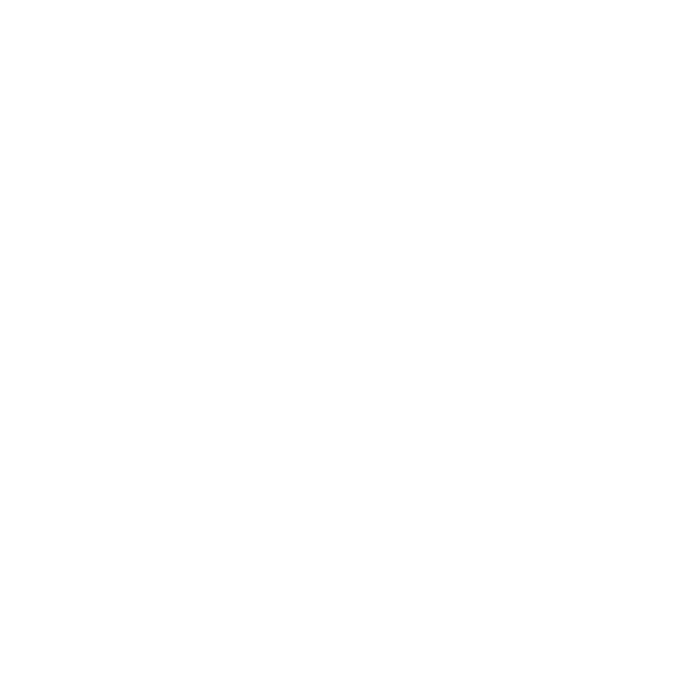

# Hi there 👋
** ```I'm a Python developer and AI enthusiast``` **
<br>
## Languages and Tools I Use 
<!-- Programming Languages Section -->
<code>Languages</code>&nbsp;&nbsp;&nbsp;
<br><br>

<!-- Deep Learning Section -->
<code>Libraries</code>&nbsp;&nbsp;&nbsp;
<br><br>

<!-- Development Section -->
<code>Backend</code>&nbsp;&nbsp;&nbsp;
<br><br>

<!-- Database Section -->
<code>Database</code>&nbsp;&nbsp;&nbsp;
<br><br>

<!-- Deployment Section -->
<code>Deployment</code>&nbsp;&nbsp;&nbsp;
<br><br>

## Projects
<p>I have worked on several full-stack and MLOps projects:</p>
<ul>
  <li><strong>Infoledge</strong>: A roadmap and course recommendation platform with integrated features like Coding and Chatbots. <a href="https://github.com/RitamhD/Infoledge" target="_blank">GitHub</a></li>
  <li><strong>Finetuning LLMs</strong>: Finetuning LLMs to solve Leetcode problems in 2025. <em>[in progress]</em></li>
  <li><strong>Personal AI Assistant</strong>: Using Ollama and Huggingface endpoints with Langchain to develop an assistant capable of answering & reasoning queries (dynamic and real-time) with speech recognition.
      <br><em>Future considerations: <code>Integrating Agents to automate with real-life tasks</code></em> <em>[in progress]</em>
  </li>
</ul>

## Contact Me
<h3>👉 <a href="https://ritam-myportfolio.netlify.app/" target="_blank">Portfolio</a></h3>
<p><a target="_blank" href="https://www.linkedin.com/in/ritam-kumar-hati-aa3021254" style="display: inline-block;"></a></p>
Email- hatiritam03@gmail.com

<p></p>
